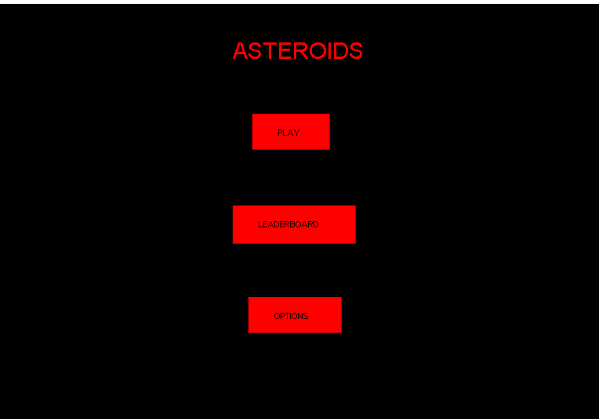
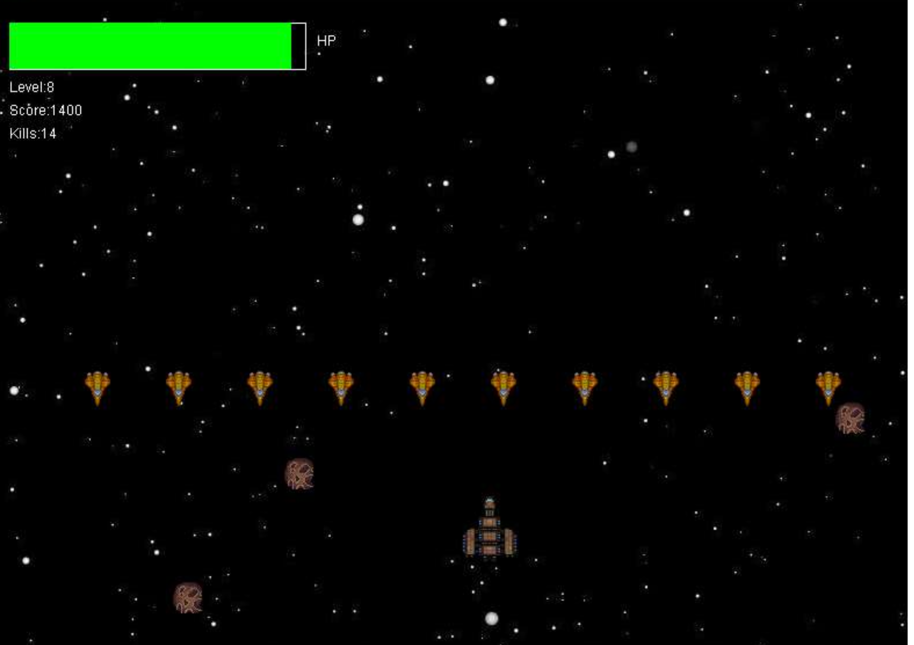

# Asteroids Revisited

Asteroids Revisited is a group project that implements the well-known game "Asteroids" from scratch using Java. The project is aimed at providing an engaging and enjoyable experience for gamers of all ages.

## Table of Contents

- [Installation](#installation)
- [Gameplay](#gameplay)
- [Features](#features)
- [Contributing](#contributing)
- [License](#license)

## Installation

To install Asteroids Revisited, follow these steps:

1. Clone the repository: `git clone https://github.com/yourusername/asteroids-revisited.git`
2. Open the project in your preferred Java IDE
3. Build and run the project

## Gameplay

In Asteroids Revisited, the player controls a spaceship and must navigate through an asteroid field while shooting down the asteroids to earn points. The game gets progressively harder as the player advances through the levels.

## Features

Asteroids Revisited includes the following features:

- Multiple levels with increasing difficulty
- Different kind of enemies
- High score tracking and leaderboard
- New sound effects and music

## Contributing

We welcome contributions from the community! To contribute to Asteroids Revisited, follow these steps:

1. Fork the repository
2. Create a new branch: `git checkout -b my-feature-branch`
3. Make your changes and commit them: `git commit -m "Add my feature"`
4. Push to the branch: `git push origin my-feature-branch`
5. Submit a pull request

Please ensure your code follows the project's coding conventions and includes appropriate tests.

## License

Asteroids Revisited is licensed under the [MIT License](LICENSE).
